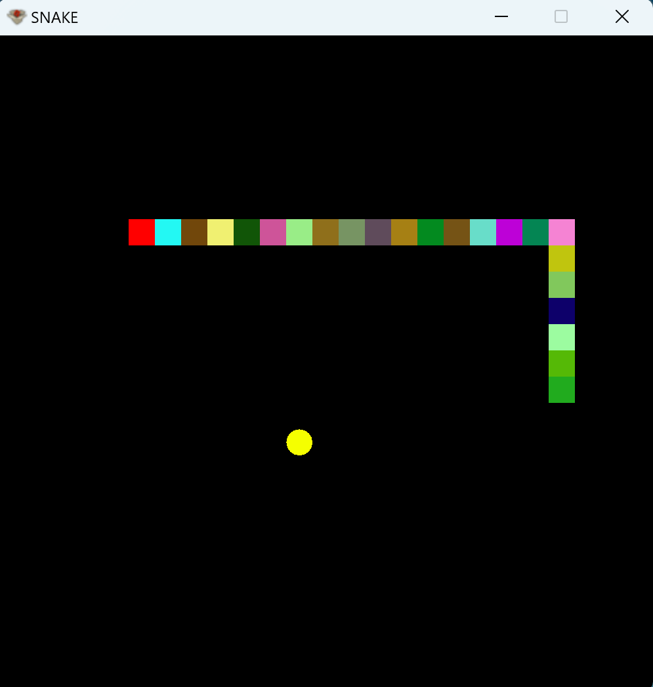

# :snake: Snake 

This is a version of the old-school game SNAKE, made with Java and the framework named <b>EngineAlpha</b>.  
It has been done as a project in a CS Class in a german highschool.  
The snake is getting random RGB values, so it's becoming a <b>large rainbow</b>.

 

 

# :computer: UI

 

 

# :blue_book: Dependencies

- EngineAlpha: <a href="https://engine-alpha.org/wiki/Hauptseite">Download</a>
  - 
